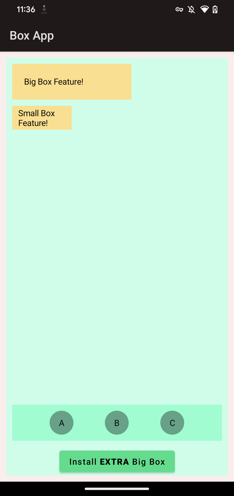

# Box App

This is a sample app demonstrating the use of Better Dynamic Features.

## Building and Installing

You will need [bundletool] installed.

```shell
./gradlew :app:bundleDebug

pushd app/build/outputs/bundle/debug

# The --local-testing flag is required to simulate feature module installation
bundletool build-apks --local-testing --bundle app-debug.aab --output app-debug.apks    
bundletool install-apks --apks app-debug.apks

popd
```

This will bundle and install the apps, and configure support for `FakeSplitInstallManager` to
simulate the installation of on-demand modules.

## Box App Structure

The sample app feature two install-time feature modules (`smallboxfeature` and `bigboxfeature`), and
one on-demand feature module (`extrabigboxfeature`). The sample demonstrates the code generation
capabilities of Better Dynamic Features to access interface implementations from feature modules.

The `:app` module defines a [`BoxAppFeature`] interface with a composable method that allows a
feature implementation to draw something on the app's `HomeScreen`. The "small" and "big" box
features are included by default, while the "extra big" box feature can be installed on demand.
These features are accessed in the `:app` module using the `dynamicImplementations()` method which
returns a `Flow` of the feature implementations.

After launching the app, the "big" and "small" box features will appear on the home screen (they are
just yellow rectangles).
Clicking the button at the bottom of the screen will install the "extra big" box feature. This will
install the `extrabigboxfeature` module, the `dynamicImplementations()` flow will automatically
update with the newly installed feature, and the "extra big" box feature will be populated onto the
home screen.



[bundletool]: https://github.com/google/bundletool
[`BoxAppFeature`]: app/src/main/kotlin/app/cash/boxapp/api/BoxAppFeature.kt
